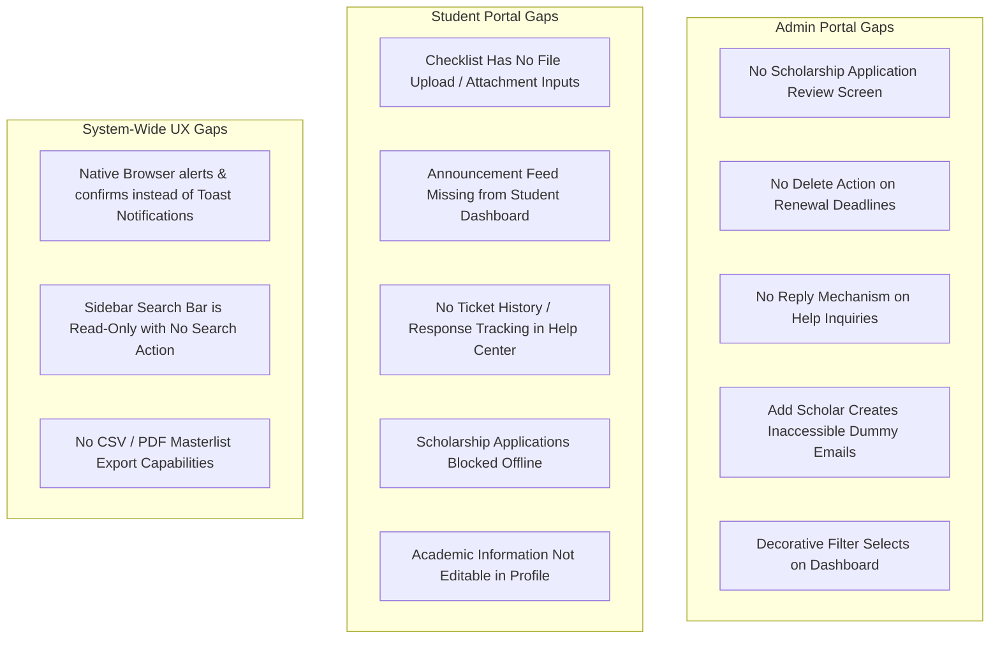

# ScholarHub System Audit: Missing UI/UX Functionalities & Gaps Documentation

This document provides a comprehensive, rigorous UI/UX and functional audit of the **ScholarHub** scholarship management system. It evaluates both the **Admin Portal** and the **Student (User) Portal**, identifying missing features, half-implemented components, UI discrepancies, and architectural gaps, accompanied by prioritized recommendations.

---

## Executive Summary

ScholarHub currently boasts a modern, aesthetic dashboard visual design (inspired by SaaS platforms like Revenio), responsive navigation, real-time notification dispatching, and dual-mode data persistence (offline `localStorage` + cloud Supabase). 

However, several critical functional workflows remain **unimplemented, read-only, or blocked**—particularly around:
1. **Administrative Application Review** (no UI exists for Admins to view or approve scholarship applicants).
2. **Student Document Submissions** (the renewal checklist is display-only with no file upload capability).
3. **Help Center Loop** (students cannot see ticket replies or status history; admins cannot reply with text).
4. **Interactive Disconnects** (decorative filter dropdowns, dead sidebar search, and native browser `alert()` popups).



---

## 1. Admin Portal Audit & Missing Functionalities

### 1.1 Scholarship Applications Review Pipeline (High Priority — Missing Entire View)
* **Current State:** Students can submit scholarship applications in cloud mode, which creates records in the `applications` table (`status: 'Submitted'`).
* **The Gap:** There is **no screen or table in the Admin Portal to review applications**.
* **Impact:** The Admin cannot view who applied for which scholarship, inspect student qualifications, download submitted proof documents, or update the application status to `Approved` or `Rejected`.
* **Required Functionality:**
  - Add an **Applications Management** view (`/admin/applications` or a dedicated tab in Scholarships).
  - Include filter pills (`All`, `Submitted`, `Under Review`, `Approved`, `Rejected`).
  - Action buttons per application: `Approve Grant`, `Reject`, `Request Resubmission`.
  - Scholar link to auto-enroll approved applicants into the active roster.

---

### 1.2 Renewal Deadline & Schedule Management (`src/views/admin/dashboard.js`)
* **Missing "Clear / Delete Deadline" Action:**
  - While appointment schedules have a red `Clear` button (`.clear-renewal-schedule`), the **Renewal Deadlines grid has no delete/clear button**.
  - If an admin enters an incorrect deadline date for a campus, there is no UI mechanism to remove or clear it.
* **No Pre-Filled Form on Edit:**
  - To adjust an existing schedule or deadline, the admin must re-select the school and re-type the datetime from scratch.
* **Dead Cycle Filter:**
  - The schedule table header contains a `<select class="pill-select compact-select"><option>Current Term</option><option>Upcoming</option></select>` that has no event listener attached.

---

### 1.3 Scholarship Programs Management (`src/views/admin/scholarships.js`)
* **Offline / Local Mode Blocked:**
  - The form submission handler explicitly halts with `if (!cloudReady()) return alert('Scholarship management requires Supabase configuration.')`.
  - Admins cannot create or test scholarship programs in local demo mode, even though `storage.js` has a `scholarshipCatalog` structure.
* **Zero Actions in Active Program Catalog:**
  - In the "Active Program Catalog" table, there is **no Edit button**, **no Delete / Archive button**, and **no Status Toggle** (`Open` ↔ `Closed`).
  - Once created, a scholarship program cannot have its deadline extended, description revised, or grant amount updated.
* **No Search or Category Filtering:**
  - Programs cannot be filtered by category (e.g. Merit-based, STEM, LGU Grant) or searched by title.

---

### 1.4 Student & Scholar Roster Management (`src/views/admin/scholars.js` & `registered.js`)
* **"Add Returning Scholar" Modal Inaccessible Accounts:**
  - The `openAddScholarModal` creates accounts with synthetic emails (`admin-added-...@local.scholarhub`) and `password: null`. These students cannot log in with these credentials.
  - In cloud mode, the modal is completely disabled via a browser alert.
* **Registered Accounts Directory is 100% Read-Only:**
  - The `registeredAccountsPage` lists students who self-registered, but has **zero row actions**.
  - An admin cannot click to view the full profile, cannot assign a scholarship grant, cannot reset a locked password, and cannot delete spam or duplicate accounts.
* **No Bulk Operations:**
  - Requirements status (`Complete` / `Lacking`) and Scholar status (`Active` / `Non-active`) must be toggled row-by-row. There is no "Select All" or "Mark All Complete" bulk action.
* **No Data Export:**
  - No "Export to CSV" or "Print Roster" button to generate physical reports for university registrars or funding agencies.

---

### 1.5 Help Center Review (`src/views/admin/helpRequests.js`)
* **No Two-Way Communication (Cannot Reply):**
  - The admin can only switch the ticket status dropdown between `Pending` and `Resolved`.
  - There is **no text input or modal to compose a response or solution** back to the student.
* **No Ticket Filtering or Search:**
  - Cannot filter by status (`Pending` vs `Resolved`) or search by student name/email.
* **No Delete / Archive:**
  - Solved tickets cannot be archived or purged.

---

### 1.6 Admin Overview Dashboard Visuals (`src/views/admin/dashboard.js`)
* **Hardcoded Chart Data:**
  - The Performance Overview bar chart uses hardcoded heights (`[42, 58, 45, 78, 65, 92]`) and months (`Apr`–`Sep`) rather than aggregating real monthly student registrations.
* **Decorative Select Dropdowns:**
  - `Period Selector` ("Academic Year 2026-2027", "First Semester", etc.) has no listener.
  - `Last 6 months` filter on the chart has no listener.
  - `More options` button (`more-horizontal`) on the Donut chart has no action.
* **Permanent Announcements:**
  - Announcements cannot be edited, pinned, or deleted once published in `adminUpdatesMarkup`.

---

## 2. Student (User) Portal Audit & Missing Functionalities

### 2.1 Renewal Documentary Checklist (`src/views/student/dashboard.js`)
* **Display-Only (No Document Upload Functionality):**
  - The checklist displays 4 mandatory requirements:
    1. Certificate of Grades (COG)
    2. Certificate of Registration (COR)
    3. Valid Student ID
    4. Barangay Clearance / Certificate of Indigency
  - **Critical Gap:** There is **no file upload button, drag-and-drop zone, or camera scanner**. Students cannot upload their PDF or image files to clear their lacking status online.
* **Hardcoded Item Statuses:**
  - In the code, COR, ID, and Clearance are hardcoded to `'Complete'`. Only COG toggles based on `account.requirementsStatus`.
  - The admin cannot mark individual documents as missing (e.g., COR missing while COG is verified).
* **CSS Selector Discrepancy:**
  - The template uses `.checklist-items-grid` and `.checklist-item-row`, while some style rules in `style.css` expect `.checklist-grid` and `.checklist-item-card`.

---

### 2.2 Announcements Feed on Student Dashboard
* **Feed Completely Missing from View:**
  - `src/components/announcements.js` defines `studentUpdatesMarkup(user)` containing the campus bulletins feed and interactive Like/Heart reactions.
  - However, `src/views/student/dashboard.js` **does not render `studentUpdatesMarkup` at all**.
  - Unless students open their notification bell tray, they never see administrative announcements on their dashboard.

---

### 2.3 Scholarship Applications (`src/views/student/scholarships.js`)
* **Offline Mode Blocked:**
  - Clicking "Apply for Scholarship" aborts with a browser alert in local demo mode, preventing user testing without a live Supabase backend.
* **No Application Form Modal:**
  - Clicking "Apply" immediately triggers a database insert with zero user confirmation.
  - It does not ask for GWA/grades, family income, proof of enrollment, or a statement of intent.
* **No "My Applications" Tracking Hub:**
  - Students cannot track the status of their submitted applications (e.g., "Submitted", "Under Review", "Approved", "Rejected") in a centralized tab or card.

---

### 2.4 Support & Help Center (`src/views/student/helpCenter.js`)
* **Vanishing Tickets (No Ticket History):**
  - Once a student clicks "Submit Ticket", the form clears and the ticket is sent.
  - There is **no history table or status card** on the page. The student cannot see if their ticket is still pending, if it was resolved, or what the admin said.

---

### 2.5 Student Profile & Academic Settings (`src/views/student/profile.js`)
* **Academic Information Missing:**
  - The profile form allows editing Name, Phone, Bio, and Password.
  - However, it **does not display or allow editing of School, Course, Year Level, or Scholar Type**.
  - If a student advances a year level (e.g., 1st Year → 2nd Year) or transfers campus, there is no way to view or request an update to their academic data.

---

### 2.6 Authentication & Account Recovery (`src/views/auth.js`)
* **Forgot Password is a Static Placeholder:**
  - Displays a static warning note that email recovery is offline. There is no input field to enter an email or submit a password reset request.
* **No Password Confirmation on Sign Up:**
  - Registration form only provides one password field (`#register-password`). If a student makes a typo during registration, they will be permanently locked out with no password confirmation guardrail.
* **No "Remember Me" Checkbox:**
  - Standard convenience feature missing from the login form.

---

## 3. Cross-Cutting & Architectural UX Gaps

### 3.1 Intrusive Native Browser Alerts & Confirms
* Throughout `src/events.js`, actions rely on:
  - `window.alert(...)`
  - `window.confirm(...)`
* **UX Impact:** Freezes UI animations, halts JavaScript thread execution, causes system audio alerts, and ruins the modern SaaS dashboard feel.
* **Solution:** Implement an inline **Toast Notification System** (`showToast(message, 'success' | 'error' | 'info')`) with smooth sliding entry, auto-dismiss in 3.5s, and custom confirm dialogs matching the Logout modal.

### 3.2 Non-Functional Sidebar Quick Search
* The sidebar search bar in `src/components/layout.js`:
  ```html
  <div class="sidebar-search">
    <input type="text" placeholder="Search..." aria-label="Quick search" readonly />
  </div>
  ```
  is marked `readonly` with no event listener. It does not search records, routes, or scholarships.

### 3.3 Lack of Empty-State Guidance & Action Triggers
* On several tables, empty states merely display a banner with an icon, without a primary CTA button (e.g. "No scholarships found — [Create First Scholarship]" or "No inquiries — [Test Support Ticket]").

---

## 4. Priority Roadmap & Action Plan

| Priority | Component | Scope | Estimated Effort |
| :--- | :--- | :--- | :--- |
| **P0 (Critical)** | **Admin Application Review View** | Build admin interface to review, approve, and reject submitted scholarship applications. | Medium |
| **P0 (Critical)** | **Student Document Uploads** | Add file upload inputs to the Renewal Checklist so students can submit COG/COR attachments. | Medium |
| **P1 (High)** | **Help Center Ticket History & Admin Reply** | Allow students to view their submitted tickets and allow admins to type a resolution reply. | Medium |
| **P1 (High)** | **In-App Toast Notification System** | Replace all `alert()` and `confirm()` calls with sleek, non-blocking toast notifications. | Low |
| **P1 (High)** | **Embed Announcements on Student Dashboard** | Render `studentUpdatesMarkup` inside `studentDashboard` so students see bulletins directly. | Low |
| **P2 (Medium)** | **Admin Catalog Management** | Add Edit, Delete, and Close Program actions to the scholarship catalog. | Medium |
| **P2 (Medium)** | **Renewal Deadline Clear Action** | Add a `Clear` button to active renewal deadlines in the admin dashboard. | Low |
| **P2 (Medium)** | **Offline Mode Application Support** | Enable local storage persistence for scholarship creation and student applications. | Low |
| **P3 (Polish)** | **Academic Info in Student Profile** | Display and allow students to request updates to School, Course, and Year Level. | Low |
| **P3 (Polish)** | **Functional Sidebar Search Palette** | Connect sidebar search to a command palette or search router. | Medium |
| **P3 (Polish)** | **CSV / Print Roster Export** | Add "Export to CSV" button on Scholar Roster and Registered Accounts tables. | Low |

---

## 5. Conclusion

Addressing these identified gaps will elevate ScholarHub from an attractive visual prototype to an **end-to-end, production-grade scholarship governance platform**, ensuring smooth communication, complete administrative control, and clear self-service monitoring for all scholars.
