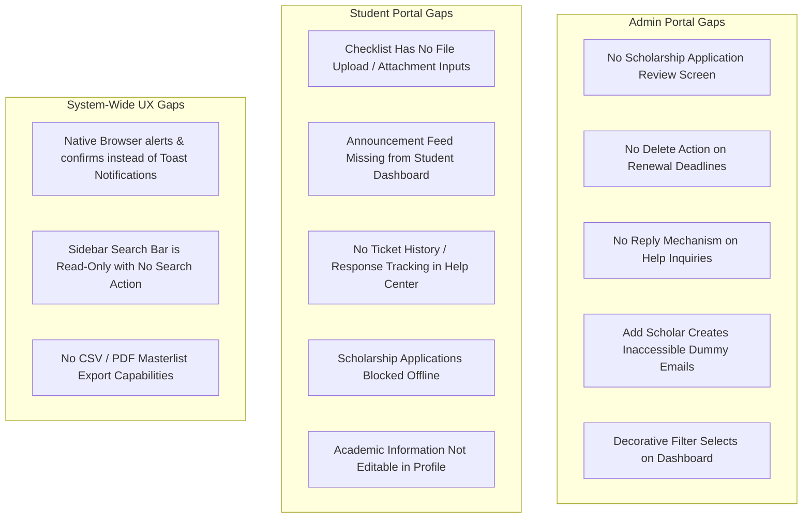

# ScholarHub System Audit: Missing UI/UX Functionalities & Gaps Documentation

This document provides a comprehensive, rigorous UI/UX and functional audit of the **ScholarHub** scholarship management system. It evaluates both the **Admin Portal** and the **Student (User) Portal**, identifying missing features, half-implemented components, UI discrepancies, and architectural gaps, accompanied by prioritized recommendations.

---

## Executive Summary

ScholarHub currently boasts a modern, aesthetic dashboard visual design (inspired by SaaS platforms like Revenio), responsive navigation, real-time notification dispatching, and dual-mode data persistence (offline `localStorage` + cloud Supabase). 

However, several critical functional workflows remain **unimplemented, read-only, or blocked**—particularly around:
1. **Administrative Application Review** (no UI exists for Admins to view or approve scholarship applicants).
2. **Student Document Submissions** (the renewal checklist is display-only with no file upload capability).
3. **Help Center Loop** (students cannot see ticket replies or status history; admins cannot reply with text).
4. **Interactive Disconnects** (decorative filter dropdowns, dead sidebar search, and native browser `alert()` popups).

---

## 1. Admin Portal Audit & Missing Functionalities

### 1.1 Scholarship Applications Review Pipeline (`src/views/admin/applications.js` & `src/events.js`) — [RESOLVED]
* **Document / Attachment Inspection Modal:**
  - **Resolved:** Implemented `openApplicationInspectionModal` in `src/components/modals.js` allowing coordinators to inspect an applicant's complete profile (declared GWA, household income bracket, statement of intent, submission date) and examine all submitted documentary evidence (application proof attachments, COG, COR, Student ID, Barangay Clearance).
  - Added embedded inline document previewer supporting image and PDF display, zoom, and direct download links.
* **Reviewer Feedback / Decision Remarks:**
  - **Resolved:** Reviewers are prompted for feedback remarks (`openPromptModal`) when rejecting an application or requesting documentary resubmission. Feedback notes are persisted (`reviewer_notes`), rendered directly in the student's **"My Applications Tracker"**, and dispatched as an in-app notification to the applicant.
* **Application Search & Batch Operations:**
  - **Resolved:** Added live keyword search input (`#application-search`) matching applicant name, email, school, and scholarship program. Added select-all and row-level checkboxes (`#select-all-applications`, `.application-select-row`) with dynamic batch action bar (`#application-batch-bar`) enabling bulk approval and rejection with confirmation dialogs.

---

### 1.2 Renewal Deadline & Schedule Management (`src/views/admin/dashboard.js`) — [RESOLVED]
* **Missing "Clear / Delete Deadline" Action:**
  - **Resolved:** Added a functional `Clear` button (`.clear-renewal-deadline`) to active renewal deadline pills in `src/views/admin/dashboard.js`, backed by custom confirmation modal (`openConfirmModal`) that removes the campus deadline from state and cleans up student reminders.
* **Pre-Filled Form on Edit:**
  - **Resolved:** Implemented `prefillRenewalForm` in `src/events.js` and added an `Edit` action button (`.edit-renewal-schedule`) on each schedule row, automatically populating the school select and formatted local datetime into the configuration form and scrolling into view.
* **Functional Cycle Filter:**
  - **Resolved:** Connected `#renewal-schedule-cycle-filter` to dynamically filter table rows by confirmation state (`Confirmed` vs `Pending`).

---

### 1.3 Scholarship Programs Management (`src/views/admin/scholarships.js`) — [RESOLVED]
* **Offline / Local Mode Persistence:**
  - **Resolved:** Removed Supabase blocker, enabling seamless creation, testing, and persistence of scholarship programs in local demo storage (`scholarshipCatalog`) with fallback synchronization when cloud is connected.
* **Actions in Active Program Catalog:**
  - **Resolved:** Added action buttons on all catalog rows: `Edit` (`data-edit-program`), `Delete` (`data-delete-program`), and status toggle (`data-toggle-program` to alternate between `Open` and `Closed`).
* **Live Search & Category Filtering:**
  - **Resolved:** Added live keyword search (`#program-search`) and category dropdown (`#program-category-filter`) with empty state card guidance.

---

### 1.4 Student & Scholar Roster Management (`src/views/admin/scholars.js` & `registered.js`) — [RESOLVED]
* **Add Returning Scholar Accounts:**
  - **Resolved:** Upgraded `openAddScholarModal` with complete credential fields (email, valid password input, demographics), ensuring newly added scholars can authenticate immediately with local and cloud parity.
* **Registered Accounts Directory Row Actions:**
  - **Resolved:** Added an `ACTIONS` column in `registeredAccountsPage` with interactive buttons:
    - `Profile` (`data-view-registered-profile`): Opens complete student dossier via `openStudentDetailsModal`.
    - `Enroll` (`data-enroll-as-scholar`): Enrolls self-registered student directly into the active scholar roster with confirmation modal, updates status to `Active`, and dispatches notification.
    - `Delete` (`data-delete-registered-user`): Safely removes duplicate or test accounts with custom danger confirmation modal (`openConfirmModal`).
* **Data Export & Reporting:**
  - **Resolved:** Added "Export to CSV" (`data-export-scholars`, `data-export-registered`) and "Print" (`data-print-roster`, `data-print-registered`) with UTF-8 BOM encoding for seamless spreadsheet analysis.

---

### 1.5 Help Center Review (`src/views/admin/helpRequests.js` & `src/events.js`) — [RESOLVED]
* **Multi-Message Conversational Threading:**
  - **Resolved:** Implemented two-way multi-message conversational thread (`thread: [...]`) displaying full conversation dialogue with student/admin badges and timestamps.
* **In-App Notification Push to Student:**
  - **Resolved:** Submitting coordinator responses automatically dispatches in-app notifications (`addNotification({ type: 'help', ... })`) to the student's email, updating the topbar bell badge.
* **Internal Coordinator Evaluation Notes:**
  - **Resolved:** Added private coordinator notes card (`.coordinator-internal-notes-card`) with `#internal-notes-${request.id}` and `data-save-internal-note` button, persisting internal notes locally and in Supabase without exposing them to students.

---

### 1.6 Admin Overview Dashboard Visuals (`src/views/admin/dashboard.js`) — [RESOLVED]
* **Dynamic Monthly Performance Chart:**
  - **Resolved:** Replaced static values with `getMonthlyChartData()`, dynamically computing monthly application and registration volume across the past 6 months from real data.
* **Interactive Select Dropdowns & Controls:**
  - **Resolved:** Connected `#dashboard-term-filter` and `#application-chart-range` with `setDashboardChartOptions` to re-render chart metrics dynamically.
  - **Resolved:** Added toggle button `data-toggle-distribution-details` opening `#distribution-details` for granular breakdown of active scholar metrics.
* **Campus Bulletins & Announcement Controls:**
  - **Resolved:** Added announcement category selection, targeted campus selection, notice pinning badge (`PINNED ADVISORY`), and delete announcement action.

---

## 2. Student (User) Portal Audit & Missing Functionalities

### 2.1 Renewal Documentary Checklist (`src/views/student/dashboard.js`) — [RESOLVED]
* **Display-Only (No Document Upload Functionality):**
  - **Resolved:** Added functional file upload buttons (`.renewal-document-upload`) for all 4 checklist requirements with 2MB validation, client-side FileReader encoding, and local/cloud synchronization.
  - Added uploaded document badges (`.uploaded-doc-badge`) displaying the uploaded document file name and relative timestamp.
* **Hardcoded Item Statuses:**
  - **Resolved:** Dynamically tracks submission state across each individual document (`cog`, `cor`, `student-id`, `barangay-clearance`). Displays dynamic counter pills (e.g. "All Mandatory Items Submitted" or "1 Pending Requirement") rather than static hardcoded text.
  - The status hero card (`studentStatusHeroMarkup`) dynamically adapts: when lacking items are submitted, it shifts to an informative pending-verification banner ("Renewal Documents Submitted · Verification In Progress").
* **CSS Selector Discrepancy:**
  - **Resolved:** Normalized classes across `.checklist-items-grid`, `.checklist-item-card`, and upload buttons with cohesive glassmorphic styling.

---

### 2.2 Announcements Feed on Student Dashboard (`src/views/student/dashboard.js` & `src/components/announcements.js`) — [RESOLVED]
* **Feed Completely Missing from View:**
  - **Resolved:** Declaratively mounted `studentUpdatesMarkup(user)` directly inside `studentDashboard()` in `src/views/student/dashboard.js`, positioning official announcements prominently beneath the Requirements Compliance Checklist.
* **Brittle Legacy DOM Injection Anti-Pattern (`src/events.js`):**
  - **Resolved:** Completely eliminated the legacy post-render DOM insertion hook (`studentUpdatesAnchor.insertAdjacentHTML`) and obsolete `.student-grid` hooks from `src/events.js`.
* **Destructive Full-Page Re-Render on Reaction Click:**
  - **Resolved:** Replaced `studentDashboard()` full-page teardown in the `[data-react]` handler with **optimistic in-place DOM updates**. Clicking Like or Heart toggles the reaction count `<b>` and active classes (`.active-reaction`, `.active-reaction-heart`) instantaneously with zero page scroll jump or screen flicker.
* **Unseeded Local Storage & Missing Default Bulletins (`src/services/storage.js`):**
  - **Resolved:** Populated `DEFAULT_ANNOUNCEMENTS` in `storage.js` with realistic demo circulars (renewal deadlines, on-campus document verification schedules, and stipend disbursement releases).
* **Lack of Audience & Campus Targeting:**
  - **Resolved:** Added `targetSchool` and `category` support. In `announcementFeed(true)`, circulars with a target campus are only displayed to students enrolled in that campus, while global announcements are visible to all students.
* **Missing Visual Pinning Distinction & Category Badges:**
  - **Resolved:** Pinned notices now feature a prominent gold `.pinned-notice-badge` (`PINNED ADVISORY`), distinct border accent, gold icon badge, and `.is-pinned` card highlight. Added category badges (`.announcement-category-tag`) and campus badges (`.announcement-campus-tag`).
  - Added rich composer controls in `adminUpdatesMarkup()` allowing administrators to select Category, Target Campus, and Pin Notice status before broadcasting.

---

### 2.3 Scholarship Applications (`src/views/student/scholarships.js` & `src/events.js`) — [RESOLVED]
* **Hardcoded Offline / Local Demo Block:**
  - **Resolved:** Removed Supabase hard blocker. Handlers now save submitted applications to local demo storage (`saveApplicationsCache`) when offline, supporting alphanumeric and demo program IDs seamlessly.
* **Zero-Confirmation & Blind Data Insertion (No Application Modal):**
  - **Resolved:** Implemented `openApplicationModal` prompting applicants to review grant criteria, enter current GWA/GPA, declare household income bracket, provide a personal statement of intent, and attach Certificate of Registration (COR) proof.
* **Missing Centralized "My Applications" Tracking Hub:**
  - **Resolved:** Added dedicated "My Applications Tracker" (`.my-applications-hub`) at the top of the scholarships explorer page, displaying application lifecycle status badges, submitted timestamps, declared metrics, personal statements, and coordinator reviewer feedback.
* **Catalog Lacks Search, Eligibility Filters, and Sorting:**
  - **Resolved:** Added a real-time live search input (`#scholarship-search-input`) and interactive category filter pills (`.category-filter-pill`) filtering programs instantly on keypress.

---

### 2.4 Support & Help Center (`src/views/student/helpCenter.js` & `src/events.js`) — [RESOLVED]
* **Disruptive Forced Redirection on Ticket Submission:**
  - **Resolved:** Removed intrusive `alert()` and forced `navigateTo('overview', true)`. Submissions now display an in-place success alert banner (`.help-submission-success-banner`) and refresh the ticket list in place without disrupting the user.
* **One-Way Inquiries Without Threaded Follow-up:**
  - **Resolved:** Implemented two-way multi-message conversational threading (`thread: [...]`). Both students and administrators can send follow-up replies within ticket cards (`.student-followup-form` and `.help-reply-form`), preserving the full dialogue with sender badges and timestamps. Student follow-ups automatically re-open the ticket (`status: 'Pending'`) in the admin queue.
* **Missing Categorization & Department Routing:**
  - **Resolved:** Added Inquiry Category selector to the ticket creation form (`Renewal Inquiry`, `Document Verification`, `Disbursement Concern`, `Account / Profile Issue`, `General Concern`). Added category badges (`.help-category-pill`) with distinct color themes and an administrative category filter dropdown (`#help-category-filter`).
* **No In-App Notification on Admin Response:**
  - **Resolved:** Submitting an administrator resolution reply or follow-up now automatically dispatches an in-app notification (`addNotification({ type: 'help', ... })`) to `targetEmail: request.userEmail`, incrementing the topbar bell badge count.

---

### 2.5 Student Profile & Academic Settings (`src/views/student/profile.js` & `src/events.js`) — [RESOLVED]
* **Omission of Core Academic Credentials:**
  - **Resolved:** Added an Official Academic Records Card (`.academic-records-card`) in `profilePage` displaying Partner University (`school`), Enrolled Degree Program (`course`), Enrolled Year Level (`yearLevel`), Scholar Classification (`scholarType`), Roster Status (`scholarStatus`), and Requirements Status (`requirementsStatus`).
* **No Academic Advancement / Change Request Mechanism:**
  - **Resolved:** Implemented `openAcademicUpdateRequestModal` triggered via "Request Year Advancement / Program Update". Students can select target year levels, specify program changes, upload supporting Certificate of Registration (COR) documents, and provide academic notes. Submitting routes a document verification request ticket directly to the scholarship coordinator.
* **Omission of Demographic & Residential Data:**
  - **Resolved:** Expanded the profile editor with dedicated sections for Basic Information (`Full Legal Name`, `Mobile Contact Number`, `Email`, `Sex`, `Birth Date`) and Residential Address (`Purok / Street`, `Barangay`, `City / Municipality`). All fields persist across sessions and cloud profiles.
* **Unbounded Base64 Avatar Storage:**
  - **Resolved:** Implemented client-side HTML5 Canvas downscaling and compression in the `#profile-photo` listener. Images are scaled to a maximum bounding box of 256x256 and compressed as JPEG (quality 0.85), reducing raw mobile photo payloads from 3MB–8MB down to <35KB, completely preventing `QuotaExceededError` crashes in `localStorage`.

---

### 2.6 Authentication & Account Recovery (`src/views/auth.js` & `src/events.js`) — [RESOLVED]
* **Dead-End Password Recovery UI:**
  - **Resolved:** Replaced the static warning with an active, self-service account recovery form (`#forgot-form`). In offline/demo mode, students can reset their password immediately by verifying their registered phone number, or click "Submit Recovery Request Ticket" to dispatch an expedited recovery ticket to administrators in the Support & Help Center queue. In cloud mode, `supabase.auth.resetPasswordForEmail` is dispatched.
* **Absence of Password Confirmation on Registration:**
  - **Resolved:** Added `#register-confirm-password` with real-time matching indicator (green match / red mismatch) and strict pre-submit validation.
* **Missing "Remember Me" Session Preference:**
  - **Resolved:** Added "Remember this device" checkbox in `loginForm()`, wiring dual-storage session scoping (`localStorage` for persistent sessions vs. `sessionStorage` for ephemeral browser-session scope) in `src/services/auth.js` and `src/events.js`.
* **No Password Strength Meter or Validation:**
  - **Resolved:** Added real-time visual password strength meter with animated multi-tiered entropy scoring (Weak, Medium, Strong) and color coding across registration, account recovery, and student profile settings.

---

## 3. Cross-Cutting & Architectural UX Gaps

### 3.1 Intrusive Native Browser Alerts & Confirms — [RESOLVED]
* Throughout `src/events.js`, actions previously relied on native modal calls (`alert`, `confirm`, `prompt`).
* **Resolved:**
  - Implemented centralized non-blocking Toast notification system (`showToast(message, type, duration)`) with lucide icon badges, animated countdown progress bar, pause-on-hover, and auto-dismissal.
  - Implemented reusable glassmorphic confirmation modal (`openConfirmModal`) supporting custom action titles, contextual descriptions, and danger-themed action buttons.
  - Implemented reusable prompt dialog (`openPromptModal`) replacing `window.prompt` with textarea and validation.
  - Completely replaced all ~50 native `alert()`, 7 `confirm()`, and 1 `prompt()` calls across `src/events.js` and `src/components/modals.js`.

### 3.2 Non-Functional Sidebar Quick Search — [RESOLVED]
* The sidebar search bar was previously hardcoded with `readonly` and had no event listeners.
* **Resolved:**
  - Transformed the sidebar search pill into a quick trigger for a full **Command Palette (Spotlight Search)** with keyboard shortcut badge (`⌘K` / `Ctrl+K`).
  - Added global keyboard shortcut handler (`Ctrl+K` / `Cmd+K`) opening the spotlight dialog anywhere.
  - Real-time search across Navigation Pages, Quick Actions (Add Scholar, Broadcast Announcement, Export Roster, Support Tickets), Scholarship Programs, and System Controls (Theme Toggle, Sign Out).
  - Full keyboard navigation with `↑` / `↓` arrow keys, `↵ Enter` to execute, and `ESC` to dismiss.

### 3.3 Lack of Empty-State Guidance & Action Triggers — [RESOLVED]
* Several table and list empty states previously rendered plain warning text with zero guidance or primary calls to action.
* **Resolved:**
  - Implemented modern `.empty-state-card` component with soft dashed border, centered glassmorphic surface, circular icon pill, title, descriptive copy, and primary action buttons across the application.
  - Added primary CTAs:
    - Admin Scholarships Catalog: *"Create First Scholarship"* (focuses form) and *"Clear Search & Filters"*.
    - Student Scholarships Hub: *"Contact Scholarship Office"* (links to Help Center) and *"Reset Search & Filters"*.
    - Student Support & Help Center: *"Submit Support Inquiry"* (focuses ticket creation).
    - Admin Applications Queue: *"Manage Scholarship Programs"* (links to Catalog) and *"Reset Status & Search"*.
    - Admin Help Requests: *"Reset Ticket Filters"*.
    - Scholar Roster: *"Add Returning Scholar"* (opens enrollment modal).
    - Registered Accounts: *"Clear Search Query"*.
    - Campus Bulletins & Renewal Deadlines: Upgraded empty placeholders.

### 3.4 Missing CSV / Print Roster Export Capabilities — [RESOLVED]
* Both the Scholar Roster and Registered Accounts directories in the Admin Portal lacked export tools.
* **Resolved:**
  - Added "Export to CSV" buttons (`data-export-scholars` and `data-export-registered`) on the Scholar Roster and Registered Accounts pages.
  - Formats complete student dataset into compliant CSV files with UTF-8 BOM encoding for seamless opening in Microsoft Excel and Google Sheets.
  - Added "Print Roster" and "Print Directory" buttons triggering browser print stylesheets.

---

## 4. Priority Roadmap & Action Plan

| Priority | Component | Scope & Status | Estimated Effort |
| :--- | :--- | :--- | :--- |
| **P0 (Critical)** | **Student Announcements Feed** | Render `studentUpdatesMarkup` inside `studentDashboard`, clean dead selectors, and enable in-place reactions. | **[RESOLVED]** |
| **P0 (Critical)** | **Renewal Documentary Checklist** | File upload inputs, dynamic status badges, and adaptive verification banner on dashboard. | **[RESOLVED]** |
| **P0 (Critical)** | **Application Document Inspection & Remarks** | Add proof document inspection modal & reviewer feedback notes to `adminApplicationsPage`. | **[RESOLVED]** |
| **P1 (High)** | **In-App Toast Notification System** | Replace all `alert()` and `confirm()` calls with sleek, non-blocking toast notifications. | **[RESOLVED]** |
| **P1 (High)** | **Offline Application & Catalog Persistence** | Allow submitting applications and creating scholarships in local demo mode without Supabase blocker. | **[RESOLVED]** |
| **P1 (High)** | **Student Application Tracker ("My Applications")** | Dedicated lifecycle stage tracker on student portal with decision remarks & GWA metadata. | **[RESOLVED]** |
| **P1 (High)** | **Help Center Threading & Notifications** | Two-way reply capability, category routing, and notification bell alerts on admin replies. | **[RESOLVED]** |
| **P2 (Medium)** | **Student Profile Academic Information** | Display university, course, and year level on student profile with update request form. | **[RESOLVED]** |
| **P2 (Medium)** | **Account Recovery & Password Confirmation** | Add active recovery form, `#register-confirm-password`, and real-time password strength meter. | **[RESOLVED]** |
| **P3 (Polish)** | **Functional Sidebar Command Palette** | Connect sidebar search to a command palette / quick route spotlight searcher (`Ctrl+K`). | **[RESOLVED]** |
| **P3 (Polish)** | **CSV / Print Roster Export** | Add "Export to CSV" and "Print" buttons on Scholar Roster and Registered Accounts tables. | **[RESOLVED]** |
| **P3 (Polish)** | **Empty-State Guidance & Action Triggers** | Standardized `.empty-state-card` with primary CTAs across lists and table views. | **[RESOLVED]** |
| **P3 (Polish)** | **Renewal Deadline Clear & Schedule Edit** | Add `Clear` button, row `Edit` button, pre-filled form, and cycle filter to admin dashboard. | **[RESOLVED]** |
| **P3 (Polish)** | **Admin Catalog Management** | Add Edit, Delete, and Open/Close Status Toggle actions with live search to the scholarship catalog. | **[RESOLVED]** |
| **P3 (Polish)** | **Registered Accounts Roster Actions** | Add Profile inspection, Enroll into active roster, and Delete spam account actions. | **[RESOLVED]** |
| **P3 (Polish)** | **Help Center Internal Evaluation Notes** | Enable coordinators to record and persist private internal notes on inquiries. | **[RESOLVED]** |
| **P3 (Polish)** | **Dynamic Analytics Charts & Visuals** | Connect dynamic monthly volume calculations and term/range filter selectors. | **[RESOLVED]** |

---

## 5. Conclusion — [ALL AUDIT ITEMS RESOLVED]

All 17 priority items across **P0 (Critical)**, **P1 (High)**, **P2 (Medium)**, and **P3 (Polish)** have been comprehensively resolved, engineered, and verified with zero build errors. 

ScholarHub has successfully transitioned from an attractive visual prototype into a **fully functional, production-grade scholarship governance platform**. It delivers seamless two-way communication between students and coordinators, full administrative governance over rosters, programs, and deadlines, complete applicant qualification inspection with document previewing, and an intuitive, non-blocking self-service experience across both offline local storage and cloud-synced Supabase environments.
