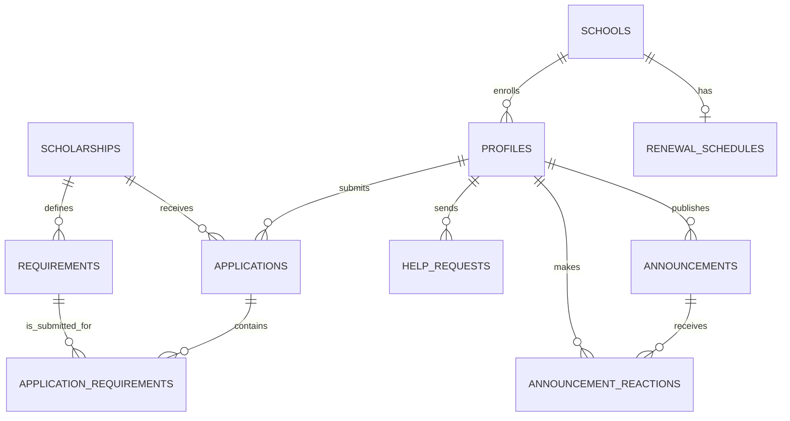

# ScholarHub database design

## Problem and requirements

ScholarHub is a scholarship-record system where students maintain a profile, see announcements and school renewal dates, send support requests, and apply to scholarship programs. Administrators manage student records, scholarship programs, requirements, announcements, renewal schedules, and application decisions.

## Entity-relationship diagram

## Entities and essential attributes

| Entity | Purpose | Key attributes |
|---|---|---|
| `profiles` | Student and admin account information | `id`, `email`, `role`, personal and academic details |
| `schools` | Canonical list of schools | `id`, `name` |
| `scholarships` | Scholarship programs managed by admin | `id`, `title`, `amount`, `deadline`, `status` |
| `requirements` | Requirements for one scholarship | `id`, `scholarship_id`, `title`, `is_required` |
| `applications` | A student's application to a program | `student_id`, `scholarship_id`, `status`, review fields |
| `application_requirements` | Requirement submission/review status | `application_id`, `requirement_id`, `file_path`, `status` |
| `announcements` | Admin posts visible to all users | `author_id`, `message`, timestamps |
| `announcement_reactions` | One like/heart per student and post | `announcement_id`, `user_id`, `reaction` |
| `help_requests` | Student support concerns | `student_id`, `subject`, `message`, `status` |
| `renewal_schedules` | Renewal date/deadline per school | `school_name`, `deadline_at`, `schedule_at` |

## Business rules

1. A profile belongs to exactly one authenticated account and has role `user` or `admin`.
2. A student may apply to many scholarships, but only once per scholarship.
3. A scholarship has many requirements; each requirement belongs to one scholarship.
4. A requirement submission belongs to one application and one requirement.
5. Students can read and manage only their own applications, submissions, reactions, and help requests.
6. Only an admin can manage scholarship programs, requirements, announcements, renewal schedules, or review decisions.
7. A school can have at most one renewal schedule record.
8. A user can make one reaction per announcement; changing it replaces the previous reaction.

## Normalization

The schema follows Third Normal Form (3NF). Each table holds one concept, non-key values depend on its primary key, and many-to-many relationships use junction tables. This prevents duplicate student, scholarship, requirement, and reaction information.
